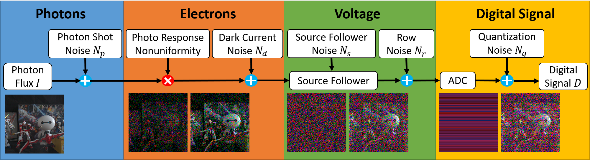
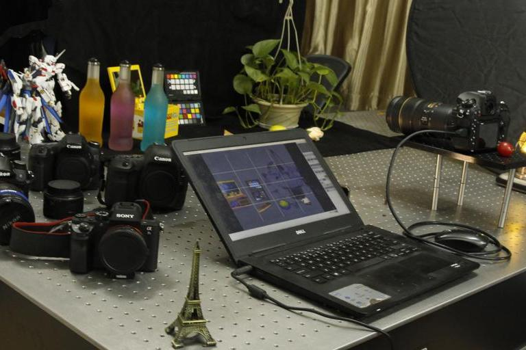
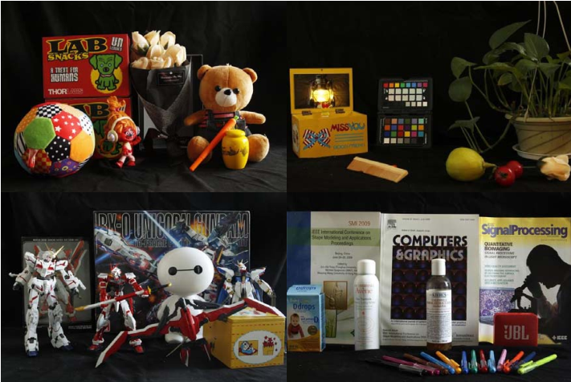
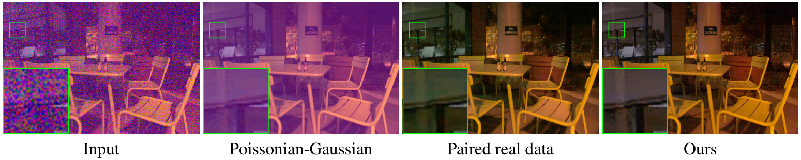
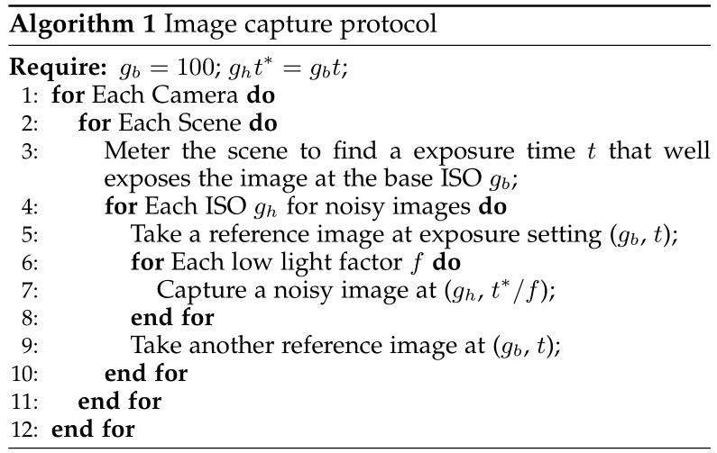

# ELD

The implementation of CVPR 2020 (Oral) paper "[A Physics-based Noise Formation Model for Extreme Low-light Raw Denoising](https://openaccess.thecvf.com/content_CVPR_2020/papers/Wei_A_Physics-Based_Noise_Formation_Model_for_Extreme_Low-Light_Raw_Denoising_CVPR_2020_paper.pdf)" and its journal (TPAMI) version "[Physics-based Noise Modeling for Extreme Low-light Photography](https://arxiv.org/abs/2108.02158)".
Interested readers are also referred to an insightful [Note](https://zhuanlan.zhihu.com/p/356933763) about this work in Zhihu (Chinese). 


## :sparkles: News
* 2022/01/08: **Major Update**: Release the training code and other related items (including synthetic datasets, customized rawpy, calibrated camera noise parameters, baseline noise models, calibrated SonyA7S2 camera response function (CRF) and a modern implementation of [EMoR](https://ieeexplore.ieee.org/document/1323796) radiometric calibration method) to accelerate further research!
* 2022/01/05: Replace the released ELD dataset by my local version of the dataset. We thank [@fenghansen](https://github.com/fenghansen) for pointing this out. Please refer to [this](https://github.com/Vandermode/ELD/issues/21) issue for more details. 
* 2021/08/05: The comprehensive version of this work was accepted to *IEEE Transactions on Pattern Analysis and Machine Intelligence* (TPAMI)
* 2020/07/16: Release the ELD dataset and our pretrained models at [GoogleDrive](https://drive.google.com/drive/folders/1QoEhB1P-hNzAc4cRb7RdzyEKktexPVgy?usp=sharing) and [Baidudisk](https://pan.baidu.com/s/11ksugpPH5uyDL-Z6S71Q5g ) (0lby)


## Highlights

* We present a highly accurate noise formation model based on the characteristics of CMOS photosensors, thereby enabling us to synthesize realistic samples that better match the physics of image formation process. 

 

* To study the generalizability of a neural network trained with existing schemes, we introduce a new Extreme Low-light Denoising (ELD) dataset that covers four representative modern camera devices for *evaluation* purposes only. The image capture setup and example images are shown as below:

  


* By training only with our synthetic data, we demonstrate a convolutional neural network can compete with or sometimes even outperform the network trained with paired real data under extreme low-light settings. The denoising results of networks trained with multiple schemes, i.e. 1) synthetic data generated by the poissonian-gaussian noise model, 2) paired read data of [SID dataset](https://github.com/cchen156/Learning-to-See-in-the-Dark) and 3) synthetic data generated by our proposed noise model, are displayed as follows:

 


## Prerequisites
* Python >=3.6, PyTorch >= 1.6
* Requirements: opencv-python, tensorboardX, lmdb, rawpy, [torchinterp1d](https://github.com/aliutkus/torchinterp1d)
* Platforms: Ubuntu 16.04, cuda-10.1

**Notice this codebase relies on my own customized rawpy**, which provides more functionalities than the official one. 
This is released together with our datasets and the pretrained models (See [GoogleDrive](https://drive.google.com/drive/folders/1QoEhB1P-hNzAc4cRb7RdzyEKktexPVgy?usp=sharing) or [Baidudisk](https://pan.baidu.com/s/11ksugpPH5uyDL-Z6S71Q5g ) (0lby))
To build rawpy from source, please first compile and install the LibRaw library following the official [instructions](https://www.libraw.org/docs/Install-LibRaw-eng.html), then type ```pip install -e .``` in the customized rawpy directory. 

## Quick Start
Due to the business license, we are unable to to provide the noise model as well as the calibration method. 
Instead, we release our collected ELD dataset and our pretrained models to facilitate future research.

To reproduce our results presented in the paper (Table 1 and 2), please take a look at ```scripts/test_SID.sh``` and ```scripts/test_ELD.sh``` 

**Update:** (2022-01-08) We release the training code and the synthetic datasets per the users' requests. The training scripts and the user instructions can be found in ```scripts/train.sh```. Additionally, we provide the baseline noise models (G/G+P/G+P*) and the calibrated noise parameters for all cameras of ELD for training (see ```noise.py``` and ```train_syn.py```), which could serve as a starting point to develop your own noise model. 

We use ```lmdb``` to prepare datasets, please refer to ```util/lmdb_data.py``` to see how we generate datasets from SID. 
We also provide a new implementation of a classic radiometric calibration method [EMoR](https://ieeexplore.ieee.org/document/1323796), and utilize it to calibrate the CRF of SonyA7S2, which could be further used to simulate realistic on-board ISP as in the commercial SonyA7S2 camera.

## ELD Dataset
The dataset capture protocol is shown as follow:

  

We choose three ISO settings (800, 1600, 3200) and four low light factors (x1, x10, x100, x200) to capture the dataset (x1/x10 is not used in our paper). Image ids 1, 6, 11, 16 represent the long-exposure reference images. Please refer to ```ELDEvalDataset``` class in ```data/sid_dataset.py``` for more details. 

## Citation

If you find our code helpful in your research or work please cite our paper.

```bibtex
@article{wei2021physics,
  title={Physics-based noise modeling for extreme low-light photography},
  author={Wei, Kaixuan and Fu, Ying and Zheng, Yinqiang and Yang, Jiaolong},
  journal={IEEE Transactions on Pattern Analysis and Machine Intelligence},
  volume={44},
  number={11},
  pages={8520--8537},
  year={2021},
  publisher={IEEE}
}

@inproceedings{wei2020physics,
  title={A Physics-based Noise Formation Model for Extreme Low-light Raw Denoising},
  author={Wei, Kaixuan and Fu, Ying and Yang, Jiaolong and Huang, Hua},
  booktitle={IEEE Conference on Computer Vision and Pattern Recognition},
  year={2020},
}
```

## Contact
If you find any problem, please feel free to contact me (kaixuan.wei at kaust.edu.sa).
A brief self-introduction (including your name, affiliation and position) is required, if you would like to get an in-depth help from me. 
I'd be glad to talk with you if more information (e.g. your personal website link) is attached. 
**Note I would not reply to any impolite/aggressive email that violates the above criteria.**
